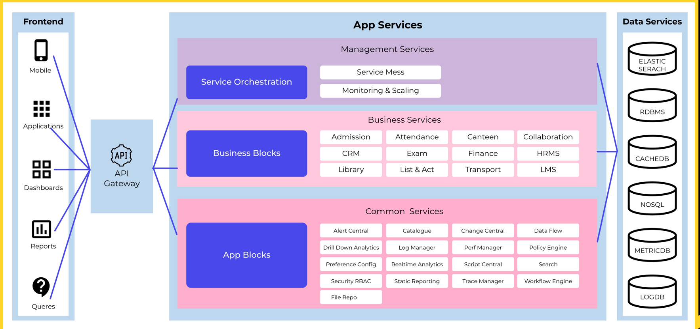

Problem Statement:
    Enterprises today need to build high-quality cost-effective cloud native microservices/serverless product(s) and solution(s) in less time and with less code. Also, they are continuously looking for a way to migrate and modernize their existing legacy application(s) in less time.

Remedy:

Deliver basic building blocks of any product with the composure of cloud native managed services along with service lifecycle so that customer can deliver product(s) and services quickly in any cloud with flexibility in architecture selection.

How AppKube Helps:

Every enterprise product has set of common features, such as Search, Security/RBAC, Preference/Config-Management, DMS (Document Management System), CMS (Content Management system), Workflow Management, Dataflow Management, Artifact Catalogue, Policy manager, Alert management, Realtime Analytics, OLP, Static Reporting, Script central. Also, different applications have different requirements, that we call Application Specific Business Blocks. Enterprises often spend a lot of time in writing these common services for multiple products. When they choose different clouds, they use the cloud provider supported services and create a composure of those services to define the common application blocks. Developing and managing these common app blocks for multiple products in different clouds involves a large effort and huge learning cycle and they spend a lot of time in writing the services lifecycle, operation, and security aspects.

 

AppKube platform delivers these common application blocks as reusable software components that compose few clouds native microservices delivered by cloud provider and includes lifecycle - the management, instrumentation, and operational management aspects. Engineering teams can reuse these common blocks and deliver products in any cloud in a unified way. They enjoy the flexibility to choose any cloud and reduce a lengthy learning cycle. They can drag and drop the common services in visual designer and choose the cloud and architectures of those common services. AppKube platform seamlessly deploys them to any cloud with all instrumentation and operation lifecycle management, which saves the engineering team effort on learning the cloud services and creating automations for the service lifecycle management. Engineering team can focus on business specific blocks and readymade common blocks can deliver the API's that is cloud and architecture agnostic. This greatly reduces any new product development or legacy product transformation effort. Engineering team can repeat your success in delivering product(s) and keep improving the common blocks API across the products.
