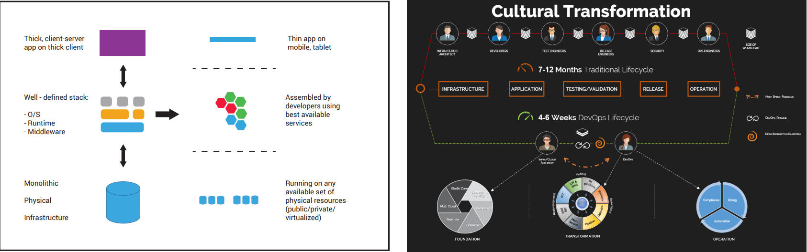

Problem Statement:
    Most enterprises are today facing competition, new products and they are not able to deliver speed, agility, flexibility, and better customer experience in lower economics because of Legacy Application and Infrastructure and IT Processes.

Remedy:
-   Modernize Legacy Technology Stack
-   Do cultural transformation with adoption of DevSecOps Tooling

How AppKube Helps:

As the enterprises are embracing modern cloud native application architecture, there is a paradigm shift of working of Developers/Security/Operations people. Developers need toolsets and SDKs to develop distributed cloud native SOA/Serverless Apps quickly, reliably in predictable manner. Security team needs toolsets to cater security and compliances across the clouds and services. Operations teams need appropriate toolsets and framework so that they can manage distributed SOA applications across clouds. Also, currently Dev, Sec, and Ops teams work in silos. Gone are the days when business used to deliver production services in a 7-12-month release cycle with a large engineering team involving multiple roles and chain of responsibilities. They are looking for simplified roles with increased responsibilities so that they can deliver services and achieve business agility and reliability.

AppKube delivers a catalogue-based toolchain for Dev/Sec/Ops team so that they can work together inside one platform and deliver services with increased agility and reliability in a distributed SOA environment. AppKube platform helps customers to provision resources across clouds in a complete software-defined way and deliver modern Container and Serverless workloads on it. Whether it is a new business application or transformation of legacy applications, the platform provides every tooling required for Developers/Operations/Security Engineers to accelerate the project execution @50% time & cost. The platform has codified and simplified the adoption of most modern cloud native services published by cloud providers. The small and simple tooling approach helps customers to create an engineering team rapidly that can apply DevSecOps methodologies and keep delivering the modern cloud native apps repeatedly with a superfast agility. AppKube prebuilt ISV solutions helps you to implement your "Build Vs Buy" objective, it helps you to become vendor neutral, transform to a hardware and license agnostic organization.
