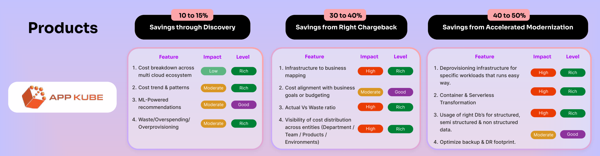

Problem Statement:
    Organizations waste about 60% of their spending on cloud services.It’s not only about reduce waste and getting costs down. It’s also about making sure your costs align with your business goals. In other words, paying more may make sense if you earn more revenue or see more productive activities and profitability from a particular cloud service. 

Remedy:
    They are looking for Cloud optimization solutions that helps 
    1. To reduce waste and avoid overspending by identifying unused resources and neglected tools
    2. identify cloud Spent is alligned with business outcome
    
How AppKube Helps:

Appkube get a 360-degree view of your multi-cloud environment, complete with actionable insights, ML-powered recommendations, and automated actions for streamlined cloud operations. It helps you to drive organization-wide improvements, enhance budgeting, and ensure compliance with security and resiliency best practices.It helps you to

-   Quickly get a cost breakdown across your multi-cloud ecosystem
-   Understand what’s leading to a continuous rise in cloud costs
-   Get a comparison of historical cost trends and patterns
-   Detect waste and resolve cost spikes in near real time
-   Evaluate cloud costs at all company levels and manage the allocation of 
    costs at the    organization and team levels.
-   Identify your businesses where you are overspending, that is cloud cost is not 
    alligned with    business outcome
-   Automate the management of cloud costs for continuous savings

Appkube looks your cloud optimization oppurtunity from three dimensions:
    1. Taking advantages of the cloud native features like spot/ reserved instance , right-sizing , autoscaling, merging idle ersource etc , which are less invasive and deliver 15-20% cost optimization in less effort.
    2. Improve your Actual Vs Non Actual ratio of infrastructure consumption. Most business , only 10% infrastructure contribute to the production environment. If this ratio is changed to 90:10 , that creates a huge difference in bottom line.This can deliver you upto 70% savings.
    3. Adopt modern architectures like container / serverless , that improves your quality and deliver at least 25% savings.   

When the above three aspects are taken care , they make a huge difference in bottomline for those organizations that spends six or seven digits on the cloud annually.

We’re proud of helping 10+ enterprises on cloud optimization and are confident in our ability to help expedite your optimization initiatives.

Your enterprise, your process , your toolsets,Tailored to You

Three ways to do cost saving:

1. Savings through Discovery (Max 10-15%):
    1. Right Sizing 
    2. Autoscaling 
    3. Reserve Instance 
    4. Spot Instances 
    5. Instance Scheduling 
 
2.  ChargeBack(20)
 Orphaned Resources / Actual Vs Non Actual Ratio improvement (30%)

3. Well Architected framework review (WAFR)

Container/ FAAS / Blob / CloudNative (Top 10)  
 
- Webserver workloads -> S3/CDN.
- Fileservers workloads -> CDN + Edge Lambda
- Analytics -> Blob + Cloud Native
- Analytics-> S3+kube
- Storage Consolidation - Blob / Git / DB
- Batch -> Lambda + Kube
- Page Content à Github
- Business Logic -> Kube
- ERP -> Build Vs Buy (S3+kube)
- Databases -> Serverless in kube / cloud
- Monolith App -> Microservices
- Bigdata/ ETL -> Fast Data
- Dev & OPS -> DevOps
- Email -> Office 365

